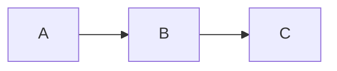

# Discord Markdown Enhancer

Chrome / Firefox Extension that renders markdown tables and Mermaid diagrams in Discord's web app.

## Features

- **Markdown Tables**: Automatically renders GFM-style tables in code blocks
- **Mermaid Diagrams**: Renders flowcharts, sequence diagrams, and more
- **Toggle View**: Switch between rendered and raw text with a hover button
- **Discord Theme**: Styled to match Discord's dark theme

## Install (Developer Mode)

### Chrome

1. Clone this repo
2. Download dependencies (see [Setup Libraries](#setup-libraries))
3. Open `chrome://extensions/`
4. Enable "Developer mode"
5. Click "Load unpacked" and select this directory

### Firefox

1. Clone this repo
2. Download dependencies (see [Setup Libraries](#setup-libraries))
3. Open `about:debugging#/runtime/this-firefox`
4. Click "Load Temporary Add-on…"
5. Select `manifest.json` from this directory

> For permanent install, package as `.zip` and submit to [Mozilla Add-ons](https://addons.mozilla.org/) for signing. Or use Firefox Developer Edition / Nightly to set `xpinstall.signatures.required = false`.

## Setup Libraries

Download and place in `libs/`:

```bash
# marked.js
curl -L -o libs/marked.min.js https://cdn.jsdelivr.net/npm/marked/marked.min.js

# mermaid.js
curl -L -o libs/mermaid.min.js https://cdn.jsdelivr.net/npm/mermaid/dist/mermaid.min.js
```

## Usage

1. Open Discord in your browser (discord.com)
2. Paste a markdown table in a code block:

````
```
| Name | Role |
|------|------|
| Alice | Dev |
| Bob | PM |
```
````

3. The table renders automatically. Hover to see the "Raw" toggle button.

For Mermaid diagrams, use a `mermaid` code block:

````

````

## Supported Mermaid Diagrams

flowchart, sequenceDiagram, classDiagram, stateDiagram, erDiagram, gantt, pie, gitGraph, journey, mindmap, timeline

## License

MIT
